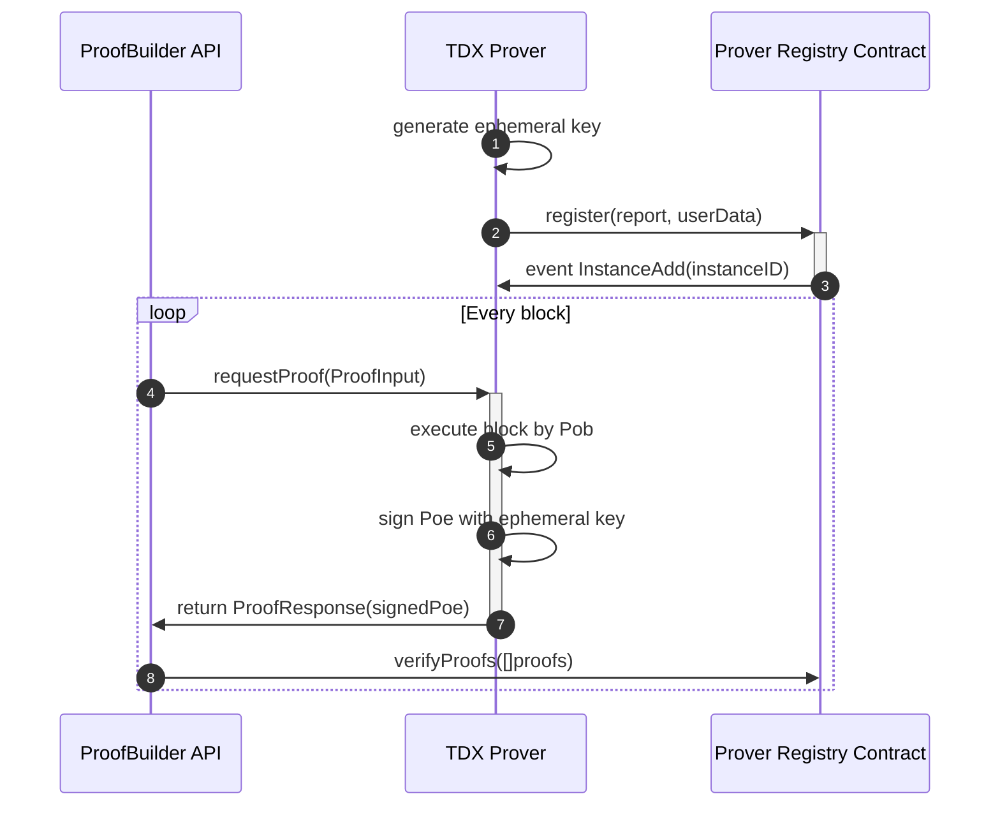

# Unifi TDX Prover

## Architecture



## Contracts

The contract implementation is [unifi-mono](https://github.com/PufferFinance/unifi-mono)

### [ProverRegistry](https://github.com/PufferFinance/unifi-mono/blob/unifi/packages/protocol/contracts/layer1/verifiers/ProverRegistryVerifier.sol)

Verify the attestation provided by the Prover and register the instance, then validate the Prover’s generated PoE.
* Register the prover to the chain with the attestation report
* Verify the PoE that it's signed by the attested prover
* Prevents the attestation report from being replayed and pre-generated
* Ephemeral key rotation

### [AttestationVerifier](https://github.com/PufferFinance/unifi-mono/blob/unifi/packages/protocol/contracts/layer1/automata-attestation/AttestationVerifier.sol)

Attesation Verification Contract for verify different kinds of attestation report.

* Predeployed TDX Attestation Verifier Contract: [0xefE368b17D137E86298eec8EbC5502fb56d27832](https://explorer-testnet.ata.network/address/0xefE368b17D137E86298eec8EbC5502fb56d27832)

## Services

### multi-prover

The Prover Service.  
Compile Command: `cargo build --release --bin multi-prover`.

### guest-input-to-proof-request
The tool for convert the `GuestInput` to `ProofRequest`.
Usage: 
```
$ cargo run --bin guest-input-to-proof-request testdata/guest-input-taiko-a7-848185.json # generate the proof requrest
$ ls -l testdata/proof-request-taiko-a7-848185.json
```

## Prover API:

* [api.rs](crates/prover/src/api.rs)
* [poe.rs](crates/prover/src/poe.rs)


## Getting started on non-TEE environment

*Note*: The prover can run on a non-TEE environment but cannot generate a valid attestation report. In this cases, the contracts needs to enable mock mode to support accepting a fake attestation report, can check two parts of code:
* [AttestationVerifier.sol](https://github.com/PufferFinance/unifi-mono/blob/8e03ed41c6a5fd76207efc9e2216ea29eeffe495/packages/protocol/contracts/layer1/automata-attestation/AttestationVerifier.sol#L44)
* [multi-prover/main.rs](bin/multi-prover/src/main.rs#L88-L92)

### Run the Prover

```
$ cargo run --release --bin multi-prover -- -c config/localhost_mock.json
[2024-09-02T09:01:26.530Z INFO  actix_server::builder] starting 32 workers
[2024-09-02T09:01:26.530Z INFO  actix_server::server] Actix runtime found; starting in Actix runtime
[2024-09-02T09:01:26.530Z INFO  actix_server::server] starting service: "actix-web-service-127.0.0.1:20300", workers: 32, listening on: 127.0.0.1:20300
[2024-09-02T09:01:30.072Z INFO  base::prover_registry] [register] waiting receipt for: 0xd7eb81cd41fd35785db46b829458395d55303ae223549c5d468bd4f024d18881
[2024-09-02T09:01:30.073Z INFO  multi_prover] registration successfully: Registration { address: 0xdb0f940ed22733980844836bc4b8fec70c9bca3e, instance_id: 3, valid_until: 1725271304 }
```

## Getting started on TDX VM

5. Compile Prover with TDX Version

```
$ cargo build --release --bin multi-prover --features tdx
$ target/release/multi-prover -c config/holesky.json
```
