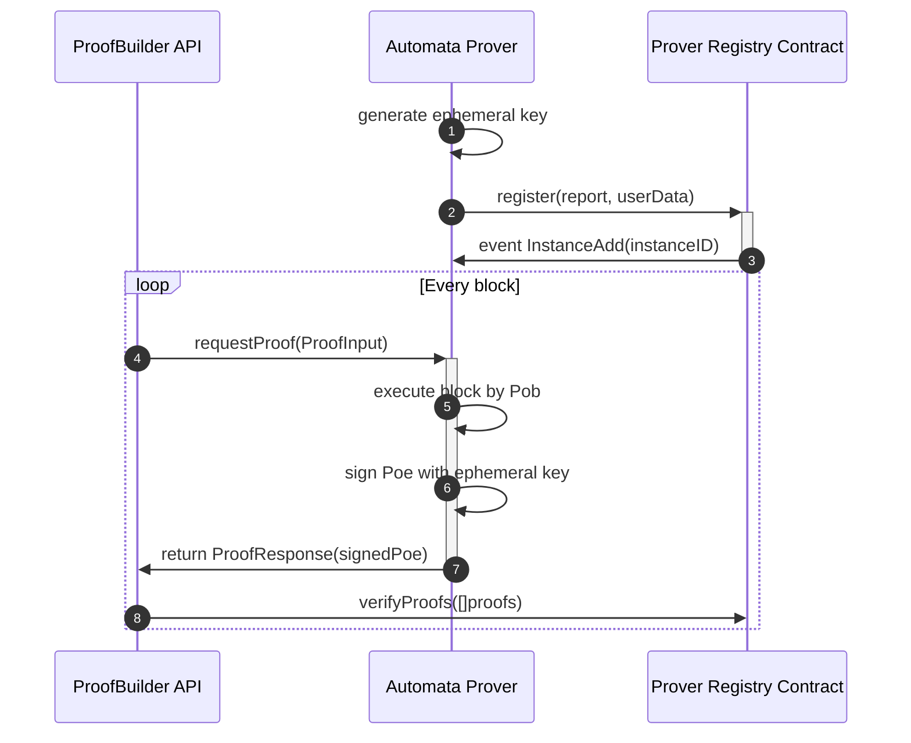

# unifi-tee-multi-prover

## Architecture



## Contracts

### ProverRegistry

Verify the attestation provided by the Prover and register the instance, then validate the Prover’s generated PoE.
* Register the prover to the chain with the attestation report
* Verify the PoE that it's signed by the attested prover
* Prevents the attestation report from being replayed and pre-generated
* Ephemeral key rotation

### AttestationVerifier

Attesation Verification Contract for verify different kinds of attestation report.

* Predeployed TDX Attestation Verifier Contract: [0xefE368b17D137E86298eec8EbC5502fb56d27832](https://explorer-testnet.ata.network/address/0xefE368b17D137E86298eec8EbC5502fb56d27832)

## Services

### multi-prover

The Prover Service.  
Compile Command: `cargo build --release --bin multi-prover`.

### proof-submitter
The Mock Service for `ProofBuilder`. It will submit the Proof Request to the prover and submit the PoE on-chain.
Compile Command: `cargo build --release --bin proof-submitter`.

### guest-input-to-proof-request
The tool for convert the `GuestInput` to `ProofRequest`.
Usage: 
```
$ cargo build --bin guest-input-to-proof-request testdata/guest-input-taiko-a7-848185.json # generate the proof requrest
$ ls -l testdata/proof-request-taiko-a7-848185.json
```

## Prover API:

* [api.rs](crates/prover/src/api.rs)
* [poe.rs](crates/prover/src/poe.rs)


## Getting started on non-TEE environment

*Note*: The prover can run on a non-TEE environment but cannot generate a valid attestation report. In this cases, the contracts needs to enable mock mode to support accepting a fake attestation report, can check two parts of code:
* [AttestationVerifier.sol](contracts/src/core/AttestationVerifier.sol#L21)
* [multi-prover/main.rs](bin/multi-prover/src/main.rs#L88-L92)

### Contract Deployment

1. Follow the instruction on the [foundry installation](https://book.getfoundry.sh/getting-started/installation) to install `forge`, `anvil`
2. Go to `contracts` directory and run `forge install`.
3. Run the Anvil to fork the testnet `anvil --fork-url https://rpc-testnet.ata.network/`

4. Deploy contracts
```
$ ATTESTATION=0x0000000000000000000000000000000000000000 ENV=localhost CHAIN_ID=167009 VERSION=1 ./scripts/deploy_verifier.sh deploy
$ # ATTESTATION=0x0000000000000000000000000000000000000000: enable the mock mode on ProverRegistry.
$ # CHAIN_ID=1: the target chain id that the prover want to prove
...
{
  "AttestationVerifier": "0xe7f1725E7734CE288F8367e1Bb143E90bb3F0512",
  "ProxyAdmin": "0x5FbDB2315678afecb367f032d93F642f64180aa3",
  "ProxyRegistryImpl": "0x9fE46736679d2D9a65F0992F2272dE9f3c7fa6e0",
  "ProxyRegistryProxy": "0xDc64a140Aa3E981100a9becA4E685f962f0cF6C9",
  "remark": "Deployment"
}
```

5. Modify the config/localhost_mock.json
```
{
    ...
    "prover_registry": "$ProxyRegistryProxy" 
}
```

### Run the Prover

```
$ cargo run --release --bin multi-prover -- -c config/localhost_mock.json
[2024-09-02T09:01:26.530Z INFO  actix_server::builder] starting 32 workers
[2024-09-02T09:01:26.530Z INFO  actix_server::server] Actix runtime found; starting in Actix runtime
[2024-09-02T09:01:26.530Z INFO  actix_server::server] starting service: "actix-web-service-127.0.0.1:20300", workers: 32, listening on: 127.0.0.1:20300
[2024-09-02T09:01:30.072Z INFO  base::prover_registry] [register] waiting receipt for: 0xd7eb81cd41fd35785db46b829458395d55303ae223549c5d468bd4f024d18881
[2024-09-02T09:01:30.073Z INFO  multi_prover] registration successfully: Registration { address: 0xdb0f940ed22733980844836bc4b8fec70c9bca3e, instance_id: 3, valid_until: 1725271304 }
```

### Test with Proof

```
$ cargo run --release --bin proof-submitter -- -c config/localhost_mock.json testdata/proof-request-taiko-a7-848185.json
[2024-09-02T09:03:35.124Z INFO  base::prover_registry] [verify_proofs] waiting receipt for: 0x0173cf82bef0aed0c6881440849e2274e74e8abecd9b6a8dc0a589bd82ea675d
[2024-09-02T09:03:35.125Z INFO  base::prover_registry] receipt: TransactionReceipt { inner: Eip1559(ReceiptWithBloom { receipt: Receipt { status: Eip658(true), cumulative_gas_used: 50207, logs: [Log { inner: Log { address: 0x2a51d7d9b1704c77a84b2a67e40e3a9d09da148b, data: LogData { topics: [0x2a1b8dadb1ac8d3250e6b9bbcf7716c47998387be4ef1c1d4a42c965123e2eec], data: 0x0000000000000000000000000000000000000000000000000000000000000001 } }, block_hash: Some(0xa4935c55cc493b3bcbba46f2caca2c7a13ab2163da1405e02726592274b21852), block_number: Some(3200772), block_timestamp: Some(1725267829), transaction_hash: Some(0x0173cf82bef0aed0c6881440849e2274e74e8abecd9b6a8dc0a589bd82ea675d), transaction_index: Some(0), log_index: Some(0), removed: false }] }, logs_bloom: 0x00000000000000000400000000000000000000000000000000000000000000000010000000000000000000000000000000000000000000000000000000000000000400000000000000001000000000000000000000000000000000000000000000000000000000000000000000000000000000000000000000000000000000000000000000000000000000000000000000000000000000000000000000000000000000000000000000000000008000000000000000000000000000000000000000000000000000000000000000000000000200000000000000000000000000000000000000000000000000000000000000000000000000000000000000000000 }), transaction_hash: 0x0173cf82bef0aed0c6881440849e2274e74e8abecd9b6a8dc0a589bd82ea675d, transaction_index: Some(0), block_hash: Some(0xa4935c55cc493b3bcbba46f2caca2c7a13ab2163da1405e02726592274b21852), block_number: Some(3200772), gas_used: 50207, effective_gas_price: 2000358, blob_gas_used: None, blob_gas_price: Some(1), from: 0x3d39c0f2469466ddf6aecf8b47c2edbdfaf9791a, to: Some(0x2a51d7d9b1704c77a84b2a67e40e3a9d09da148b), contract_address: None, state_root: Some(0x0000000000000000000000000000000000000000000000000000000000000000), authorization_list: None }
```

## Getting started on TDX VM

*Note*: Currently we support performing the on-chain attestation verification on automata testnet. Next we can migrate the services/contract to holesky.

1. Follow the instruction on the [foundry installation](https://book.getfoundry.sh/getting-started/installation) to install `forge`
2. Go to `contracts` directory and run `forge install`.
3. Deploy contracts
```
$ # 0xefE368b17D137E86298eec8EbC5502fb56d27832 is a predeploy contract for verify tdx attestation report.
$ ATTESTATION=0xefE368b17D137E86298eec8EbC5502fb56d27832 ENV=ata_testnet CHAIN_ID=1 VERSION=1 ./scripts/deploy_verifier.sh deploy
...
{
  "AttestationVerifier": "0x793B475655e376eE1863b98E01428FF22b946850",
  "ProxyAdmin": "0xee3c2d4d8e9F77DDA12F257c292E41685303A633",
  "ProxyRegistryImpl": "0xB818DCCEd037Fb4016D5387B0bF33B0675c8B704",
  "ProxyRegistryProxy": "0x35afc7a1a557812a89A4e087d7458910B986EF0b",
  "remark": "Deployment"
}
```

4. Modify the config/ata_testnet_tdx.json
```
{
    ...
    "prover_registry": "$ProxyRegistryProxy" 
}
```

5. Compile Prover with TDX Version

```
$ cargo build --release --bin multi-prover --features tdx
$ target/release/multi-prover -c config/att_testnet_tdx.json
```

6. Compile The TDX-GUEST

```
$ go install github.com/google/go-tdx-guest/tools/attest@latest
$ cp $(which attest) .
```

7. Check the directory structure

```
├── multi-prover
├── config
│    └── ata_testnet_tdx.json
├── attest
```

8. Run the Prover

```
$ ./multi-prover -c config/ata_testnet_tdx.json
```

## Test

### Network

* Rpc: [https://rpc-testnet.ata.network/](https://rpc-testnet.ata.network/)
* Automata Testnet (feel free to transfer to your account): 
    * (default) [0x27Ed3CEbAA82F0168142A20d1f8a0e3e7A78474A](https://explorer-testnet.ata.network/address/0x27Ed3CEbAA82F0168142A20d1f8a0e3e7A78474A): `5f919e9ae75499f533f2b3eec29065b1af1daec4050447b05fc2f0d53c4c1473`
    * [0xD85773530d5A4ab6A39135bE64Cfc91a037e12fA](https://explorer-testnet.ata.network/address/0xD85773530d5A4ab6A39135bE64Cfc91a037e12fA): `4661437dae866bf1edbec18c855cdcbee7bf8237c043e23f5eaac5f6d36a6001`
* If you want to modify the key or RPC, please edit the [.env](.env) file